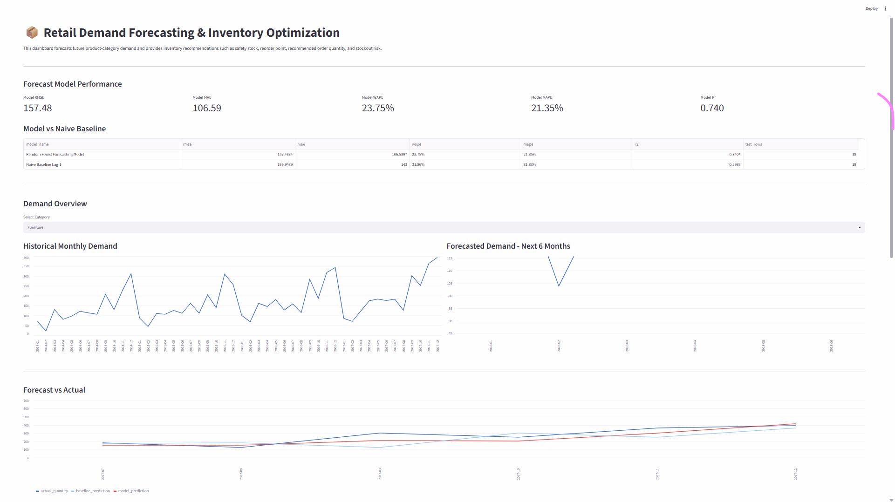
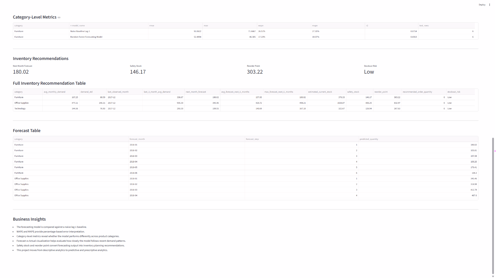
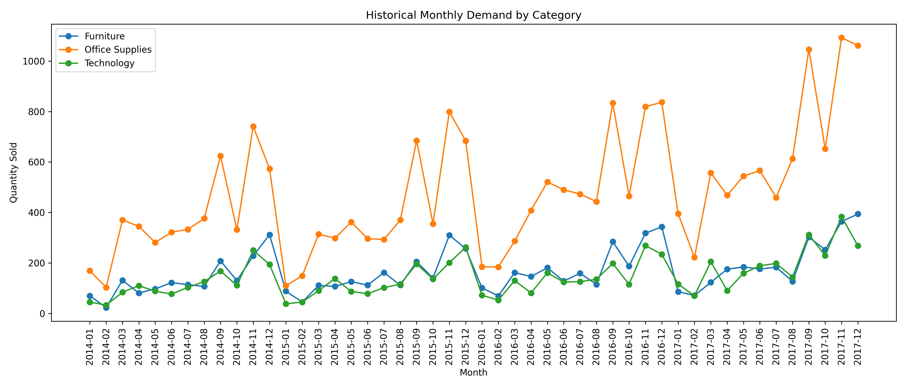
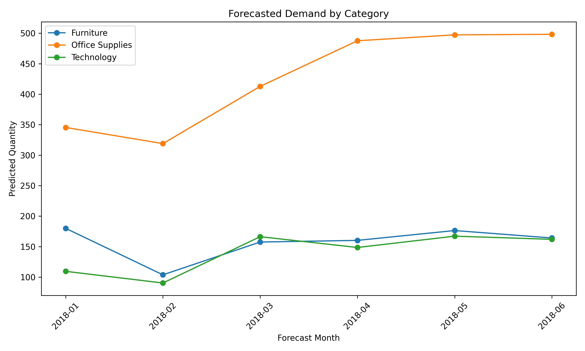
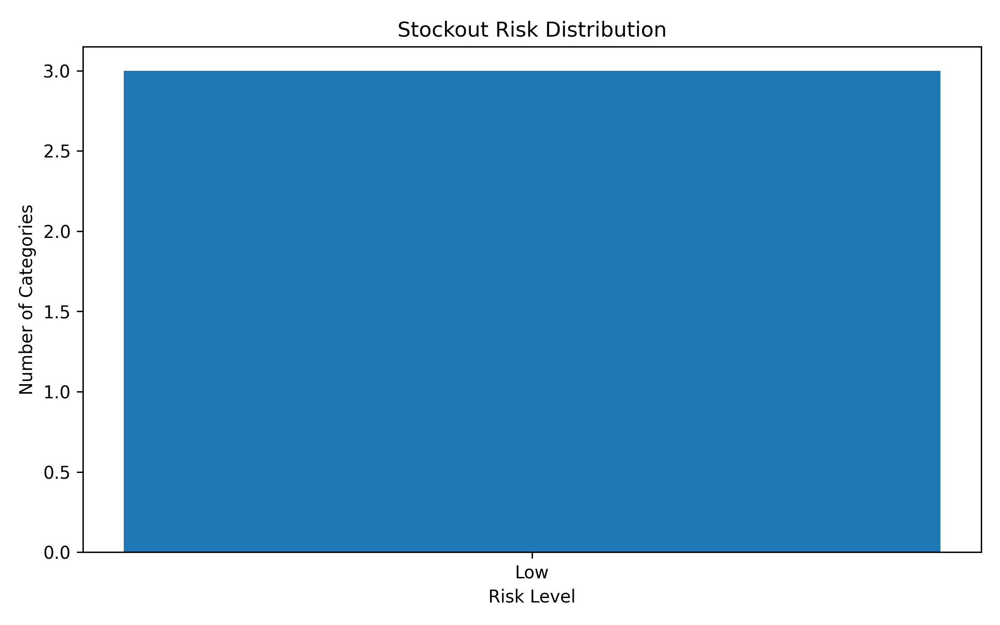
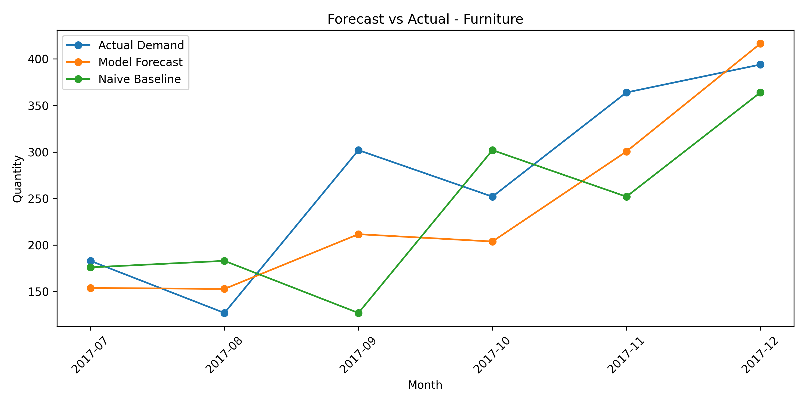
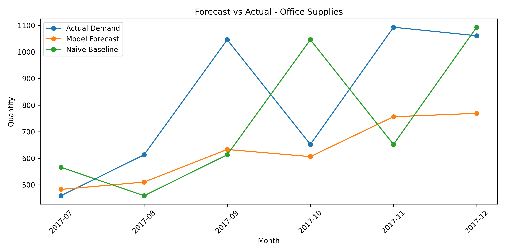
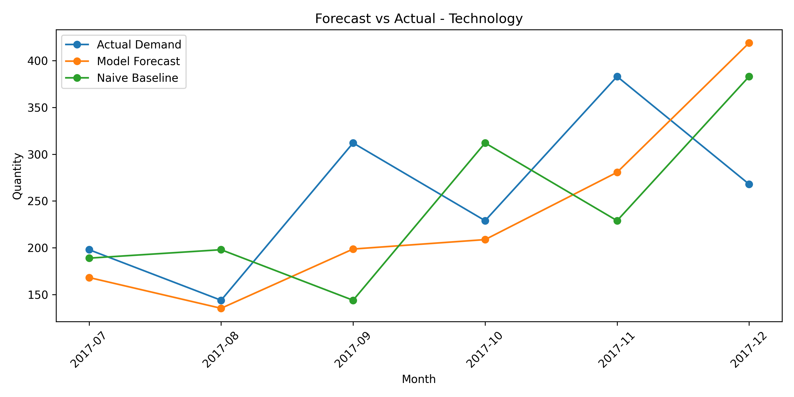

# Retail Demand Forecasting & Inventory Optimization

An end-to-end data science project for forecasting retail product-category demand and generating inventory planning recommendations.

This project moves beyond descriptive sales analytics and focuses on predictive and prescriptive analytics using time-series feature engineering, machine learning forecasting, baseline comparison, forecast evaluation, and inventory optimization logic.

---

## Project Overview

Retail businesses need accurate demand forecasts to reduce stockouts, avoid overstocking, and improve inventory planning.

This project uses the Superstore sales dataset to forecast future demand at the product-category level and generate inventory recommendations such as:

- Next-month demand forecast
- Six-month demand forecast
- Safety stock
- Reorder point
- Recommended order quantity
- Stockout risk level

The project includes:

- Data loading
- Data cleaning
- Monthly demand aggregation
- Time-series feature engineering
- Lag feature creation
- Random Forest forecasting model
- Naive baseline comparison
- Forecast evaluation with RMSE, MAE, WAPE, MAPE, and R²
- Category-level forecast metrics
- Forecast vs actual analysis
- Inventory recommendation logic
- Streamlit dashboard
- Result visualizations

---

## Dataset

The project uses the Superstore sales dataset.

Raw data file:

```text
data/raw/superstore.csv
```

The raw dataset is excluded from GitHub using `.gitignore`.

The dataset contains:

| Metric | Value |
|---|---:|
| Rows | 9,994 |
| Columns | 21 |
| Missing values | 0 |

Main fields include:

- Order ID
- Order Date
- Ship Date
- Customer ID
- Segment
- Region
- Category
- Sub-Category
- Product Name
- Sales
- Quantity
- Discount
- Profit

---

## Project Structure

```text
retail-demand-forecasting/
│
├── app/
│   └── streamlit_app.py
│
├── data/
│   ├── raw/
│   └── processed/
│
├── models/
│   └── demand_forecasting_model.joblib
│
├── results/
│   ├── figures/
│   │   ├── historical_monthly_demand.png
│   │   ├── forecasted_demand.png
│   │   ├── stockout_risk_distribution.png
│   │   ├── forecast_vs_actual_furniture.png
│   │   ├── forecast_vs_actual_office_supplies.png
│   │   └── forecast_vs_actual_technology.png
│   │
│   ├── forecast_metrics.csv
│   ├── category_forecast_metrics.csv
│   ├── forecast_vs_actual.csv
│   ├── demand_forecast.csv
│   └── inventory_recommendations.csv
│
├── screenshots/
│   ├── retail_dashboard_forecast_overview.png
│   └── retail_dashboard_inventory_recommendations.png
│
├── src/
│   ├── __init__.py
│   ├── config.py
│   ├── data_loader.py
│   ├── preprocessing.py
│   ├── forecasting.py
│   ├── inventory.py
│   ├── visualization.py
│   └── utils.py
│
├── .gitignore
├── main.py
├── README.md
└── requirements.txt
```

---

## Methodology

### 1. Data Cleaning

The raw Superstore dataset is cleaned using Python and Pandas.

Cleaning steps include:

- Standardizing column names
- Converting order and shipping dates into datetime format
- Converting numeric fields into numeric types
- Removing duplicates
- Removing invalid date or demand records
- Creating time-based columns
- Creating profit margin

Created columns:

```text
order_year
order_month
order_year_month
profit_margin
```

---

### 2. Monthly Demand Aggregation

The forecasting problem is created by aggregating order-level data into monthly demand by product category.

The monthly demand table includes:

```text
category
order_year_month
total_quantity
total_sales
total_profit
order_count
year
month
```

This transforms transactional sales data into a time-series forecasting dataset.

---

### 3. Time-Series Feature Engineering

Lag-based features are created for each category:

```text
lag_1
lag_2
lag_3
rolling_mean_3
```

These features allow the model to learn from recent demand patterns.

---

## Forecasting Model

The forecasting model used is:

```text
Random Forest Regressor
```

Model features:

```text
category
year
month
lag_1
lag_2
lag_3
rolling_mean_3
```

Target variable:

```text
total_quantity
```

The model is saved as:

```text
models/demand_forecasting_model.joblib
```

---

## Baseline Model

To make the evaluation more meaningful, the model is compared with a naive baseline:

```text
Naive Baseline Lag-1
```

This baseline predicts the current month demand using the previous month demand.

This is important because a forecasting model should be compared against a simple business baseline, not evaluated in isolation.

---

## Forecast Evaluation

Overall model performance:

| Model | RMSE | MAE | WAPE | MAPE | R² |
|---|---:|---:|---:|---:|---:|
| Random Forest Forecasting Model | 157.48 | 106.59 | 23.75% | 21.35% | 0.740 |
| Naive Baseline Lag-1 | 196.95 | 143.00 | 31.86% | 31.83% | 0.594 |

The Random Forest model outperformed the naive baseline across all major metrics.

Key improvement:

```text
WAPE improved from 31.86% to 23.75%.
```

This means the model reduced the overall weighted absolute percentage error compared with the simple lag-1 baseline.

---

## Category-Level Forecast Metrics

| Category | Model | RMSE | MAE | WAPE | MAPE | R² |
|---|---|---:|---:|---:|---:|---:|
| Furniture | Random Forest | 52.50 | 46.59 | 17.23% | 18.07% | 0.691 |
| Furniture | Naive Baseline | 91.06 | 71.67 | 26.51% | 27.35% | 0.071 |
| Office Supplies | Random Forest | 252.48 | 202.36 | 24.66% | 21.13% | 0.007 |
| Office Supplies | Naive Baseline | 309.14 | 260.17 | 31.70% | 32.27% | -0.489 |
| Technology | Random Forest | 88.91 | 70.83 | 27.70% | 24.85% | -0.316 |
| Technology | Naive Baseline | 111.84 | 97.17 | 38.01% | 35.88% | -1.082 |

Category-level analysis shows that the model improves WAPE for all categories compared with the baseline. The strongest performance is observed for Furniture, while Technology remains more volatile and harder to forecast.

---

## Future Demand Forecast

The model forecasts demand for the next six months for each category.

Example forecast output:

| Category | Forecast Month | Predicted Quantity |
|---|---|---:|
| Furniture | 2018-01 | 180.02 |
| Furniture | 2018-02 | 103.81 |
| Furniture | 2018-03 | 157.58 |
| Office Supplies | 2018-01 | 345.46 |
| Office Supplies | 2018-02 | 318.98 |
| Office Supplies | 2018-03 | 412.78 |

---

## Inventory Optimization

The project converts demand forecasts into inventory recommendations.

Inventory metrics include:

- Average monthly demand
- Demand standard deviation
- Last 3-month average demand
- Next-month forecast
- Average forecast for next 6 months
- Safety stock
- Reorder point
- Recommended order quantity
- Stockout risk

The formulas used are:

```text
Safety Stock = Z-score × Demand Standard Deviation × sqrt(Lead Time)

Reorder Point = Forecasted Demand During Lead Time + Safety Stock

Recommended Order Quantity = max(Reorder Point - Estimated Current Stock, 0)
```

The default assumptions are:

```text
Lead time = 1 month
Service level Z-score = 1.65
Estimated current stock = Last 3-month average demand × 1.10
```

---

## Inventory Recommendation Results

| Category | Avg Monthly Demand | Safety Stock | Reorder Point | Stockout Risk |
|---|---:|---:|---:|---|
| Furniture | 167.25 | 146.17 | 303.22 | Low |
| Office Supplies | 477.21 | 406.25 | 832.97 | Low |
| Technology | 144.56 | 126.94 | 267.63 | Low |

---

## Streamlit Dashboard

The project includes an interactive Streamlit dashboard.

Run the dashboard:

```bash
streamlit run app/streamlit_app.py
```

Dashboard components include:

- Forecast model performance
- Model vs naive baseline comparison
- Category selector
- Historical monthly demand
- Forecasted demand for next 6 months
- Forecast vs actual chart
- Category-level metrics
- Inventory recommendations
- Forecast table
- Business insights

---

## Dashboard Preview

### Forecast Performance and Demand Overview



### Inventory Recommendations and Forecast Tables



---

## Result Visualizations

### Historical Monthly Demand



### Forecasted Demand



### Stockout Risk Distribution



### Forecast vs Actual - Furniture



### Forecast vs Actual - Office Supplies



### Forecast vs Actual - Technology



---

## How to Run

### 1. Clone the repository

```bash
git clone https://github.com/Zahra-ziaee/retail-demand-forecasting.git
cd retail-demand-forecasting
```

### 2. Create and activate virtual environment

Windows PowerShell:

```bash
python -m venv .venv
.venv\Scripts\Activate.ps1
```

### 3. Install dependencies

```bash
pip install -r requirements.txt
```

### 4. Add dataset

Place the raw Superstore CSV file here:

```text
data/raw/superstore.csv
```

### 5. Run the pipeline

```bash
python main.py
```

### 6. Run the dashboard

```bash
streamlit run app/streamlit_app.py
```

---

## Outputs

Running the project generates:

```text
data/processed/superstore_cleaned.csv
data/processed/monthly_category_demand.csv

models/demand_forecasting_model.joblib

results/forecast_metrics.csv
results/category_forecast_metrics.csv
results/forecast_vs_actual.csv
results/demand_forecast.csv
results/inventory_recommendations.csv

results/figures/historical_monthly_demand.png
results/figures/forecasted_demand.png
results/figures/stockout_risk_distribution.png
results/figures/forecast_vs_actual_furniture.png
results/figures/forecast_vs_actual_office_supplies.png
results/figures/forecast_vs_actual_technology.png

screenshots/retail_dashboard_forecast_overview.png
screenshots/retail_dashboard_inventory_recommendations.png
```

---

## Business Insights

- The Random Forest forecasting model outperformed the naive lag-1 baseline.
- WAPE improved from 31.86% to 23.75%, showing better demand prediction accuracy.
- Furniture had the strongest category-level performance.
- Technology remained more volatile and harder to forecast, although the model still improved over the baseline.
- Safety stock and reorder point convert forecasting results into practical inventory planning recommendations.
- The project supports both predictive analytics and prescriptive inventory decision-making.

---

## Current Status

Completed:

- Data loading
- Data cleaning
- Monthly demand aggregation
- Lag feature engineering
- Forecasting model training
- Baseline comparison
- WAPE and MAPE evaluation
- Category-level forecast metrics
- Forecast vs actual analysis
- Future demand forecasting
- Inventory recommendation logic
- Streamlit dashboard
- Dashboard screenshots
- Result visualizations
- GitHub-ready structure

Planned next steps:

- Add product-level forecasting
- Add region-level demand forecasting
- Add model comparison with XGBoost or Prophet
- Add rolling-window backtesting
- Add inventory cost simulation
- Add scenario analysis for different service levels

---

## Technologies Used

- Python
- Pandas
- NumPy
- Scikit-learn
- Random Forest Regressor
- Matplotlib
- Streamlit
- Joblib
- Git
- GitHub

---

## Resume Summary

```text
Retail Demand Forecasting & Inventory Optimization | Python, Pandas, Scikit-learn, Streamlit, Time-Series Forecasting

- Built an end-to-end demand forecasting pipeline using Superstore sales data to predict category-level retail demand.
- Engineered time-series lag features, rolling averages, and monthly demand aggregates for forecasting.
- Trained a Random Forest forecasting model and compared it against a naive lag-1 baseline.
- Improved WAPE from 31.86% to 23.75% and achieved an overall R² score of 0.740.
- Generated inventory planning recommendations including safety stock, reorder point, recommended order quantity, and stockout risk.
- Built a Streamlit dashboard for forecast performance, forecast vs actual analysis, category-level metrics, and inventory recommendations.
```

---

## Author

Zahra Ziaee


Focus: Forecasting, Inventory Analytics, Machine Learning, Business Intelligence, and Data-Driven Decision Making